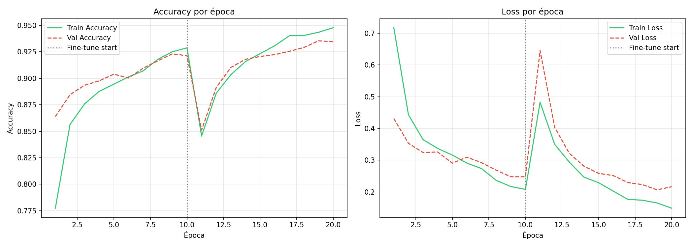
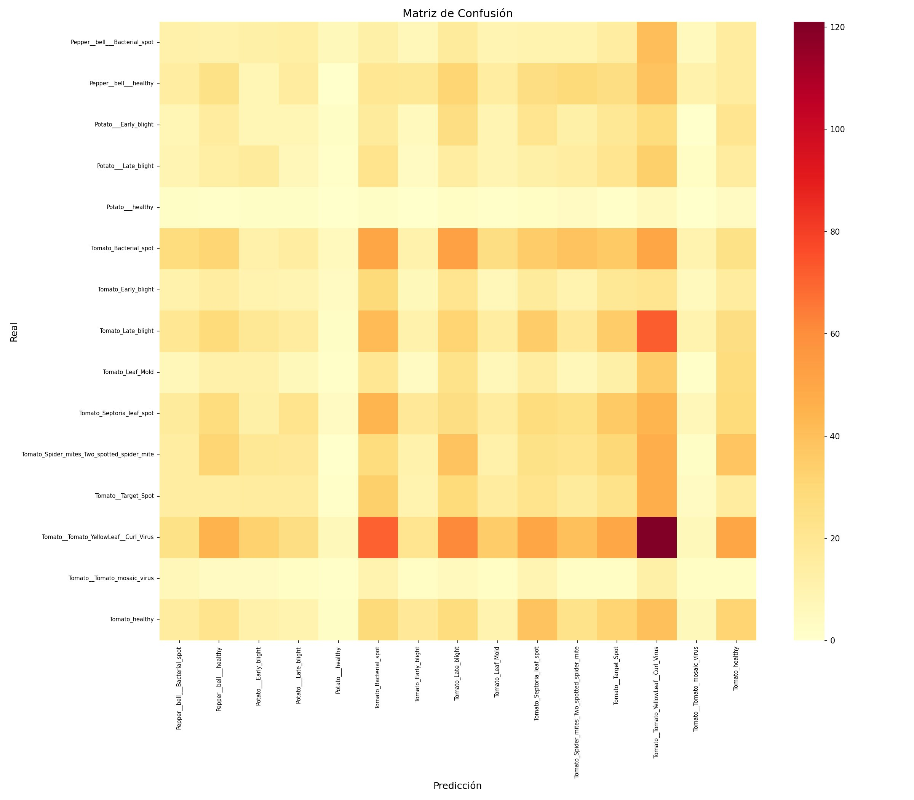

# 🌿 Plant Disease Classifier

Clasificador de enfermedades en hojas de plantas usando **Transfer Learning con MobileNetV2**.  
Proyecto Final — Inteligencia Artificial | UDLAP | Otoño 2024

---

## 📊 Resultados Obtenidos

| Métrica | Fase 1 (Feature Extraction) | Fase 2 (Fine-Tuning) |
|---|---|---|
| Accuracy de validación | ~93.0% | **~93.5%** |
| Accuracy de entrenamiento | ~93.0% | ~94.7% |
| Loss de validación | ~0.30 | ~0.21 |
| Loss de entrenamiento | ~0.21 | ~0.16 |

### Curvas de Entrenamiento


### Matriz de Confusión


---

## 📋 Descripción

Sistema de visión computacional capaz de identificar **38 clases** de enfermedades en plantas a partir de fotografías de hojas. Utiliza MobileNetV2 preentrenada en ImageNet como extractor de características, adaptada mediante transfer learning al dominio de patología vegetal.

**Dataset:** [PlantVillage](https://www.kaggle.com/datasets/emmarex/plantdisease) — 54,309 imágenes de 14 especies de plantas.

---

## 🧠 Arquitectura del Modelo

```
Input (224×224×3)
      ↓
MobileNetV2 base (preentrenada ImageNet)
      ↓
GlobalAveragePooling2D
      ↓
BatchNormalization
      ↓
Dense(256, activation='relu')
      ↓
Dropout(0.4)
      ↓
Dense(38, activation='softmax')
      ↓
Output: clase + confianza
```

| Componente | Detalle |
|---|---|
| Arquitectura base | MobileNetV2 (ImageNet) |
| Parámetros totales | ~3.5M |
| Tamaño del modelo | ~14 MB |
| Input | 224 × 224 × 3 RGB |
| Optimizer | Adam (lr: 1e-3 → 1e-5) |
| Loss | Categorical Crossentropy |
| Tiempo de inferencia | < 100 ms |

---

## 🚀 Cómo Ejecutar

### Requisitos
- Cuenta en [Google Colab](https://colab.research.google.com) (gratuita)
- Cuenta en [Kaggle](https://www.kaggle.com) para descargar el dataset

### Paso 1 — Abrir Colab y activar GPU
```
Runtime > Change runtime type > T4 GPU > Save
```

### Paso 2 — Clonar el repositorio
```bash
!git clone https://github.com/TU_USUARIO/plant-disease-classifier.git
%cd plant-disease-classifier
!pip install -r requirements.txt -q
```

### Paso 3 — Descargar el dataset
```python
# Sube tu kaggle.json (Settings > API > Create Legacy API Key)
from google.colab import files
files.upload()

!mkdir -p ~/.kaggle
!cp kaggle.json ~/.kaggle/
!chmod 600 ~/.kaggle/kaggle.json
!kaggle datasets download -d emmarex/plantdisease --unzip -p ./plantvillage
```

### Paso 4 — Entrenar el modelo (~40 minutos)
```python
%run train_model.py
```

### Paso 5 — Lanzar la interfaz
```python
%run app_interface.py
# Se genera un link público: https://xxxxxxxx.gradio.live
```

---

## 🌱 Plantas y Enfermedades Soportadas

| Especie | Condiciones Detectadas |
|---|---|
| 🍅 Tomate | Bacterial Spot, Early Blight, Late Blight, Leaf Mold, Septoria Leaf Spot, Spider Mites, Target Spot, YellowLeaf Curl Virus, Mosaic Virus, Healthy |
| 🍎 Manzana | Apple Scab, Black Rot, Cedar Apple Rust, Healthy |
| 🌽 Maíz | Cercospora Leaf Spot, Common Rust, Northern Leaf Blight, Healthy |
| 🥔 Papa | Early Blight, Late Blight, Healthy |
| 🍇 Uva | Black Rot, Esca, Leaf Blight, Healthy |
| 🍑 Durazno | Bacterial Spot, Healthy |
| 🫑 Pimiento | Bacterial Spot, Healthy |
| + 7 más | Arándano, Cereza, Naranja, Frambuesa, Soya, Calabaza, Fresa |

---

## 📁 Estructura del Repositorio

```
plant-disease-classifier/
├── README.md                 # Este archivo
├── requirements.txt          # Dependencias Python
├── train_model.py            # Entrenamiento del modelo (2 fases)
├── app_interface.py          # Interfaz web con Gradio
└── results/
    ├── training_curves.png   # Curvas de accuracy y loss
    └── confusion_matrix.png  # Matriz de confusión
```

> **Nota:** El modelo entrenado (`plant_disease_model.keras`) y el dataset no se incluyen por su tamaño. Generarlos siguiendo los pasos de arriba.

---

## ⚠️ Limitaciones Conocidas

- El dataset fue capturado en condiciones de laboratorio (hoja individual, fondo blanco). El rendimiento puede reducirse con fotos de campo con fondo complejo.
- Solo reconoce las 14 especies incluidas en PlantVillage.
- La clase `Tomato_YellowLeaf_Curl_Virus` presenta la mayor tasa de confusión con otras enfermedades de tomate de síntomas similares.

---

## 📚 Referencias

- Mohanty, S. P., Hughes, D. P., & Salathé, M. (2016). Using deep learning for image-based plant disease detection. *Frontiers in Plant Science*, 7, 1419.
- Sandler, M., et al. (2018). MobileNetV2: Inverted residuals and linear bottlenecks. *CVPR 2018*.
- Hughes, D., & Salathé, M. (2015). An open access repository of images on plant health. *arXiv:1511.08060*.
- Ferentinos, K. P. (2018). Deep learning models for plant disease detection. *Computers and Electronics in Agriculture*, 145, 311–318.

---

## 👨‍💻 Autores

| | |
|---|---|
| **Curso** | Inteligencia Artificial |
| **Profesor(a)** | Dra. Alejandra Hernandez Sanchez |
| **Institución** | UDLAP — Depto. Computación, Electrónica y Mecatrónica |
| **Término** | Otoño 2024 |
